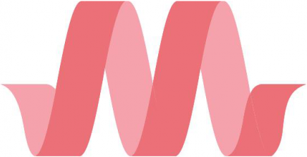

# Cadastro de clientes

Aprendizado do CRUD PHP e do framework [Materialize](https://materializecss.com/getting-started.html) a partir do desenvolvimento de um sistema que cadastra clientes genéricos em um BD relacional (MySQL).

## Hospedagem e SGBD 

Para a hospedagem do sistema foi utilizado o servidor Apache e na criação e gestão do BD MySQL, o PHPMyAdmin, ambos pertencentes ao [XAMPP](https://www.apachefriends.org/pt_br/download.html).

## Banco de Dados 

O BD <b>crud</b> possui uma única tabela chamada <b>cliente</b>, contendo os campos <b>id, nome, sobrenome, email e telefone</b> a fim de auxiliar no aprendizado do CRUD. O script do BD foi exportado do PHPMyAdmin e pode ser encontrado no diretório [bd_mysql](https://github.com/Gwolner/crud-php-front-materialize/tree/master/bd_mysql).

## Front Materialize 

Explicar como funciona o front

## CRUD PHP 

Explicar organização da estrutura do código, colocar metodos novos que aprendi e explicar pra que servem.
