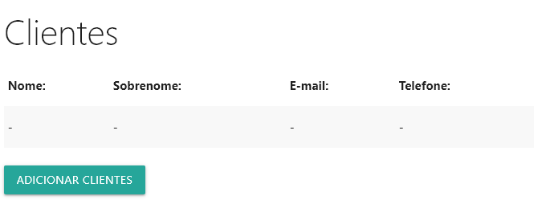
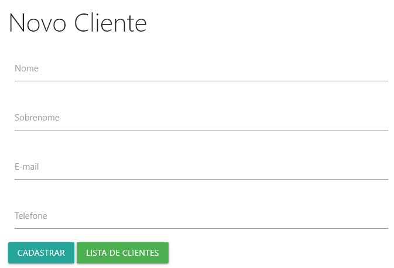
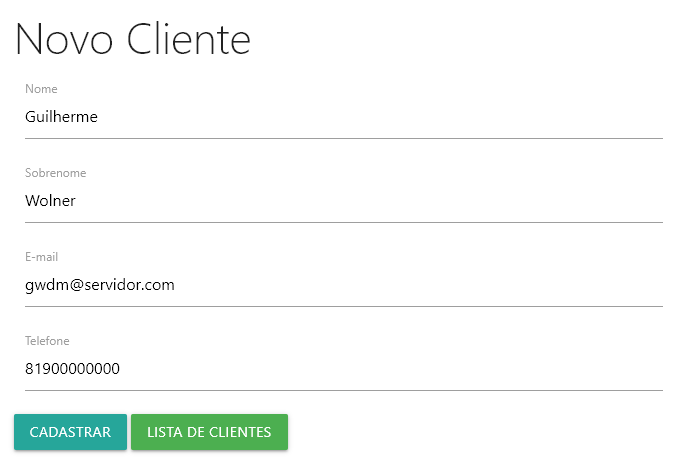
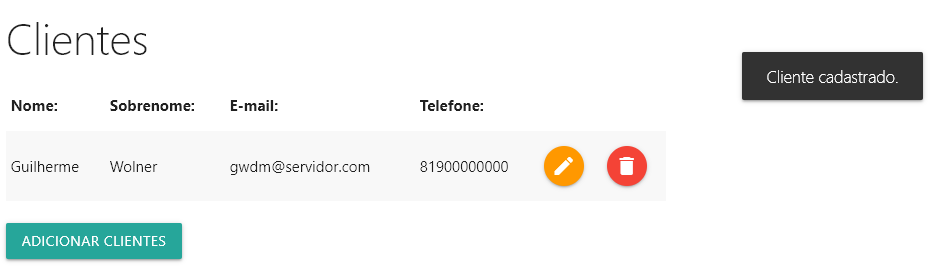
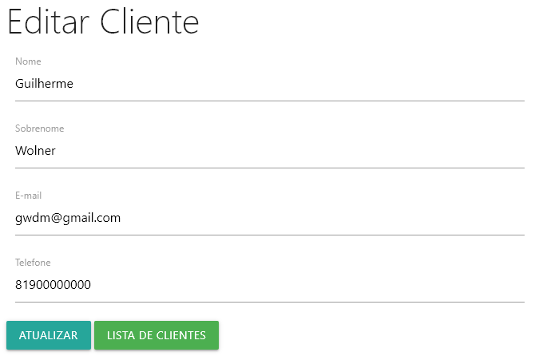
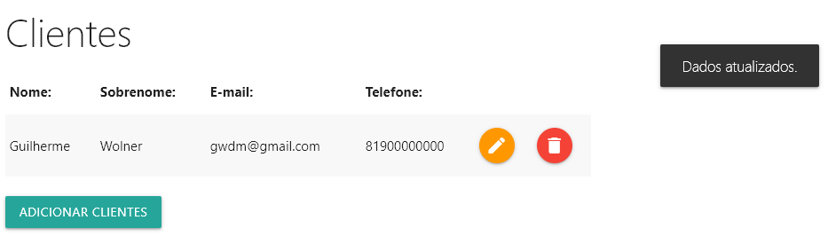
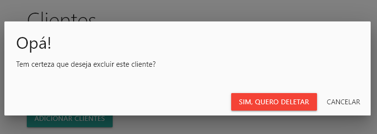
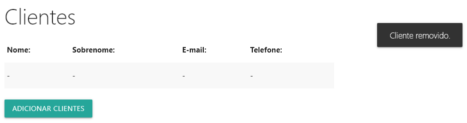

# Cadastro de clientes

Aprendizado do CRUD PHP e do framework [Materialize](https://materializecss.com/getting-started.html) a partir do desenvolvimento de um sistema que cadastra clientes genéricos em um BD relacional (MySQL).

## Hospedagem e SGBD 

Para a hospedagem do sistema foi utilizado o servidor Apache e na criação e gestão do BD MySQL, o PHPMyAdmin, ambos pertencentes ao [XAMPP](https://www.apachefriends.org/pt_br/download.html).

## Banco de Dados 

O BD <b>crud</b> possui uma única tabela chamada <b>cliente</b>, contendo os campos <b>id, nome, sobrenome, email e telefone</b> a fim de auxiliar no aprendizado do CRUD. O script do BD foi exportado do PHPMyAdmin e pode ser encontrado no diretório [bd_mysql](https://github.com/Gwolner/crud-php-front-materialize/tree/master/bd_mysql).

## Front Materialize 

Ao acessar a aplicação, a primeira tela que se vê é de uma listagem vazia de clientes.



Clicando em <b>Adicionar clientes</b>, o usuário é redirecionado para uma página contendo um formulário.



Basta preencher os dados e clicar em <b>Cadastrar</b>.



Uma mensagem de confirmação surgirá, por alguns segundos, no canto direito da tela.



Clicando no botão laranja é possivel atualizar os dados do cliente.



Após atualizar os dados necessários, basta clicar em <b>Atualizar</b>. Uma mensagem de confirmação da operação surgirá por alguns segundos.



Clicando no botão vermelho, um modal surgirá pedindo confirmação de exclusão do cliente.



Confirmada a exclusão, o registro é apagado e uma mensagem é exibida por alguns segundos, confirmando a exclusão.



## CRUD PHP 

Os arquivos de maior complexidade que compõem a aplicação possuem seus códigos expostos abaixo para uma melhor análise e entendimento de sua funcionalidade dentro do sistema.

* <b>includes/message.php</b>

```php
<?php
# Sessão
session_start();
if(isset($_SESSION["mensagem"])):
?>

<script>
	//Mensagem de sucesso ou erro ao cadastarar
	window.onload = function(){
		M.toast({html: "<?php echo $_SESSION["mensagem"];?>"});
	};
</script>


<?php
endif;
session_unset();
?>
```

* <b>php_action/update.php</b>

```php
<?php
# Sessão
session_start();
# Conexão
require_once 'db_connect.php';

if(isset($_POST['btn-editar'])){
    $nome = mysqli_escape_string($connect, $_POST['nome']);
    $sobrenome = mysqli_escape_string($connect, $_POST['sobrenome']);
    $email = mysqli_escape_string($connect, $_POST['email']);
    $telefone = mysqli_escape_string($connect, $_POST['telefone']);
    $id = mysqli_escape_string($connect, $_POST['id']);

    $sql = "UPDATE cliente SET nome = '$nome', sobrenome = '$sobrenome', email = '$email', telefone = '$telefone' 
            WHERE id = '$id'";

    if(mysqli_query($connect, $sql)){
        $_SESSION["mensagem"] = "Dados atualizados.";
        header('location: ../index.php');
    }else{
        $_SESSION["mensagem"] = "Erro ao atualizar!";
        header('location: ../index.php');
    }

}


?>
```

* <b>php_action/delete.php</b>

```php
<?php
# Sessão
session_start();
# Conexão
require_once 'db_connect.php';

if(isset($_POST['btn-deletar'])){
   
    $id = mysqli_escape_string($connect, $_POST['id']);

    $sql = "DELETE FROM cliente WHERE id = '$id'";

    if(mysqli_query($connect, $sql)){
        $_SESSION["mensagem"] = "Cliente removido.";
        header('location: ../index.php');
    }else{
        $_SESSION["mensagem"] = "Erro ao deletar!";
        header('location: ../index.php');
    }

}


?>
```

* <b>php_action/db_connect.php</b>

```php
<?php 
# Conexão com BD

$servername = "localhost";
$username = "root";
$password = "";
$db_name = "crud";

$connect = mysqli_connect($servername, $username, $password, $db_name);
mysqli_set_charset($connect, "UTF-8");

if(mysqli_connect_error()){
    echo "Erro na conexão: ".mysqli_connect_error();
}

?>
```

